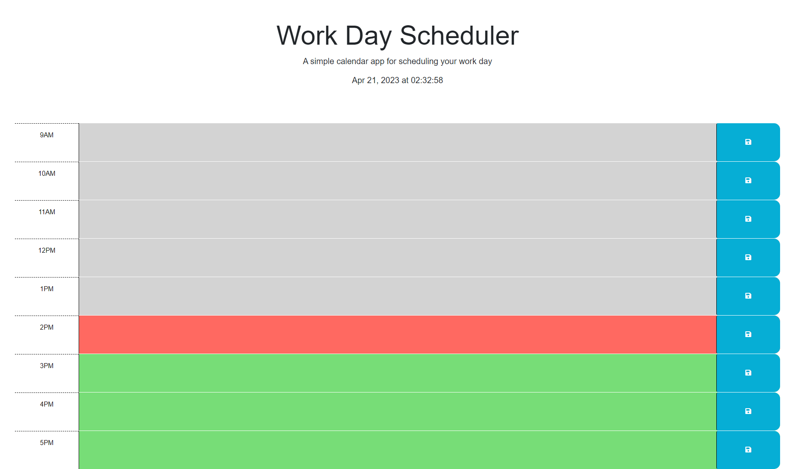

# <Your-Project-Title>

## Description

Provide a short description explaining the what, why, and how of your project. Use the following questions as a guide:

A work scheduler application that will help you throughout your days to let you know what you have planned for work. Working on this project helped me 
learn more about JS and how to display time in real time along with using if function to match up the times on the work schedule and color code it accordingly.
It also helped me learn that case sensitive and naming have to be strict. Another thing it helped me learn for formatting time in HH is military time.

## Usage

Visit my deployed page here: https://hajiru.github.io/work-scheduler-hw/

## Credits

<a href="https://github.com/Joecode22">Joeseph McKinney</a>,
<a href="https://github.com/rxs291">Rex Sarchan</a>

They both helped me out with my javascript and explained what I had wrong and what it was doing!

## License

Refer to LICENSE in the repository.
